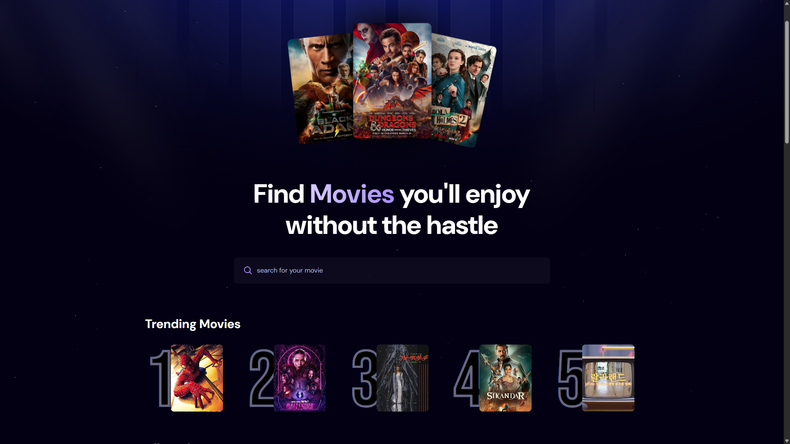

# 🎬 MovieFinder - Smart Movie Discovery App

> Find movies you'll enjoy without the hassle - powered by intelligent search analytics and trending algorithms.



## ✨ Features

- 🔍 **Smart Search** - Real-time movie search with debounced input
- 📈 **Trending Analytics** - Track popular searches and display trending movies
- 🎯 **Intelligent Recommendations** - Discover movies based on community preferences
- ⚡ **Fast Performance** - Optimized with Vite and React 19
- 🎨 **Modern UI** - Beautiful interface with Tailwind CSS
- 📱 **Responsive Design** - Works seamlessly on all devices
- 🔄 **Real-time Updates** - Live data synchronization with Appwrite

## 🚀 Technologies Used

### Frontend

- **React 19** - Latest React with modern hooks and concurrent features
- **Vite** - Lightning-fast build tool and development server
- **Tailwind CSS 4** - Utility-first CSS framework for modern styling
- **React Hooks** - useState, useEffect for state management
- **React-Use** - Powerful collection of React hooks (useDebounce)

### Backend & Database

- **Appwrite** - Open-source Backend-as-a-Service platform
  - Cloud database for storing search analytics
  - Real-time data synchronization
  - RESTful APIs for data operations
  - Built-in authentication and security

### External APIs

- **TMDB (The Movie Database) API** - Comprehensive movie database
  - Movie search functionality
  - Popular movie discovery
  - High-quality movie posters and metadata
  - Real-time movie information

### Development Tools

- **ESLint** - Code linting and quality assurance
- **Vite Config** - Optimized development and build configuration
- **Environment Variables** - Secure API key management

## 🏗️ Architecture & Algorithms

### Search Algorithm

- **Debounced Search**: 800ms delay prevents excessive API calls
- **Smart Caching**: Efficient state management for search results
- **Error Handling**: Graceful fallbacks for network issues

### Trending Algorithm

The app implements a sophisticated trending system:

```javascript
// Trending calculation based on search frequency
Query.limit(5), // Top 5 most searched
  Query.orderDesc('count'); // Ordered by search count
```

1. **Data Collection**: Every search increments a counter for that movie
2. **Aggregation**: Movies are ranked by total search count
3. **Real-time Updates**: Trending list updates automatically
4. **Performance**: Limited to top 5 for optimal loading

### Data Flow Architecture

```
User Input → Debounce → API Call → State Update → UI Render
     ↓
Analytics Tracking → Appwrite Database → Trending Calculation
```

## 📊 Analytics & Insights

The app provides powerful analytics features:

- **Search Frequency Tracking** - Monitor which movies are most popular
- **Trending Algorithms** - Real-time calculation of trending content
- **User Behavior Analysis** - Understand search patterns and preferences
- **Data Persistence** - All analytics stored securely in Appwrite

## 📞 Support & Contact

If you have any questions or need help with setup:

- 📧 Email: daramistefa30@gmail.com

---

**Made with ❤️ and lots of ☕ by Dara01**

_Enjoy discovering your next favorite movie! 🍿_
